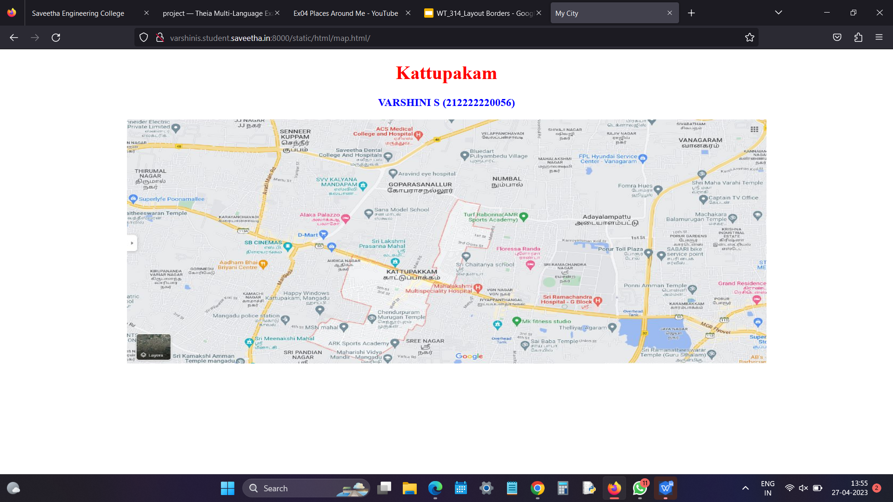
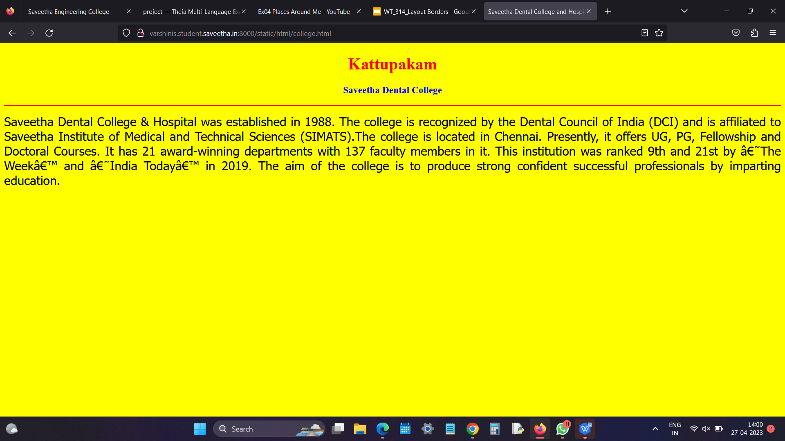
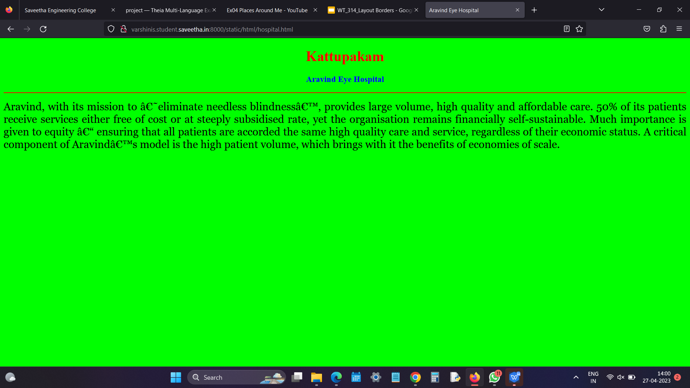
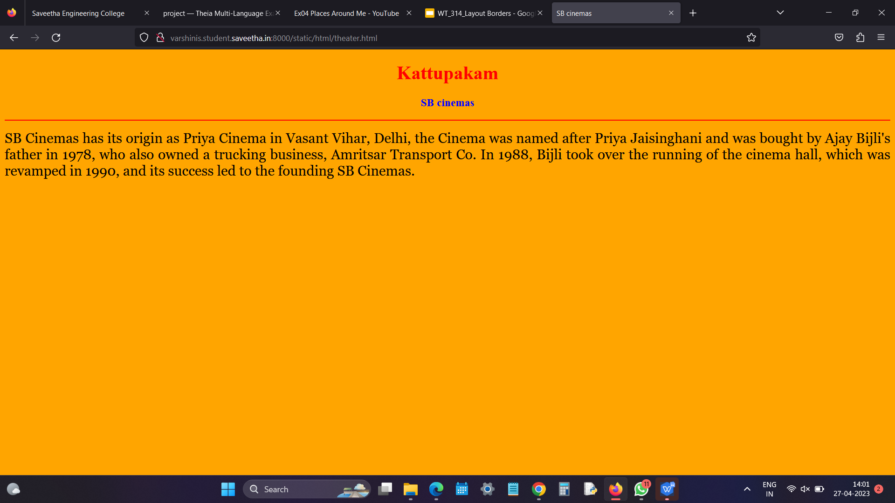
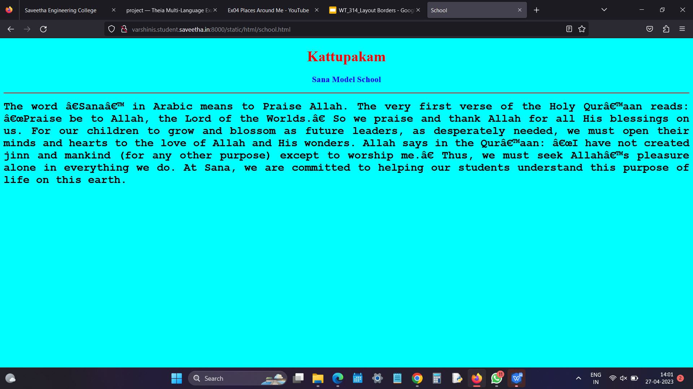
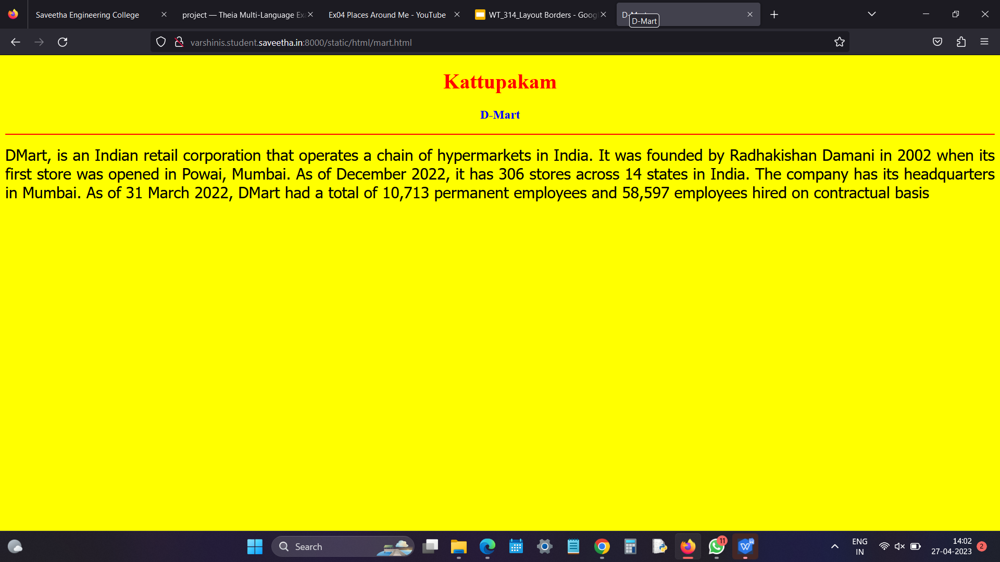
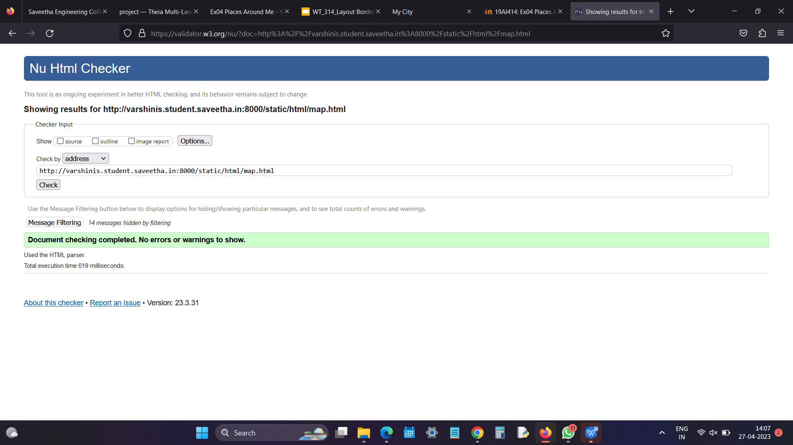

# Places Around Me
## AIM:
To develop a website to display details about the places around my house.

## Design Steps:

### Step 1:
clone the github repository in to the theia IDE

### Step 2:
create a new django project

### Step 3:
write the needed html code

### Step 4:
run the django server and execute the html files
## Code:
```
map.html
<!DOCTYPE html>
<html lang="en">
<head>
<title>My City</title>
</head>
<body>
<h1 align="center">
<font color="red"><b>Kattupakam</b></font>
</h1>
<h3 align="center">
<font color="blue"><b>VARSHINI S (212222220056)</b></font>
</h3>
<center>

<map name="MyCity">
<area shape="circle" coords="190,50,20" href="/static/html/ghs.html" title="Sana Model school">
<area shape="rectangle" coords="230,30,260,60" href="/static/html/rto.html" title="D-Mart">
<area shape="circle" coords="400,350,50" href="/static/html/vk.html" title="Aravind Eye Hospital">
<area shape="circle" coords="400,200,75" href="/static/html/bus.html" title="SB Cinemas">
<area shape="rectangle" coords="490,150,870,320" href="/static/html/park.html" title="Saveetha Dental College and Hospital">
</map>
</center>
</body>
</html>

college.html
<!DOCTYPE html>
<html lang="en">
<head>
<title>Saveetha Dental College and Hospital</title>
</head>
<body bgcolor="yellow">
<h1 align="center">
<font color="red"><b>Kattupakam</b></font>
</h1>
<h3 align="center">
<font color="blue"><b>Saveetha Dental College</b></font>
</h3>
<hr size="3" color="red">
<p align="justify">
<font face="Tahoma" size="5">
Saveetha Dental College & Hospital was established in 1988. 
The college is recognized by the Dental Council of India (DCI) and is affiliated 
to Saveetha Institute of Medical and Technical Sciences (SIMATS).The college is located in Chennai.
Presently, it offers UG, PG, Fellowship and Doctoral Courses. It has 21 award-winning departments with 137 faculty members in it. This institution was ranked 9th and 21st by ‘The Week’ and ‘India Today’ in 2019. 
The aim of the college is to produce strong confident successful professionals by imparting education. 
</font>
</p>
</body>
</html>

hospital.html
<!DOCTYPE html>
<html lang="en">
<head>
<title>Aravind Eye Hospital</title>
</head>
<body bgcolor="lime">
<h1 align="center">
<font color="red"><b>Kattupakam</b></font>
</h1>
<h3 align="center">
<font color="blue"><b>Aravind Eye Hospital</b></font>
</h3>
<hr size="3" color="red">
<p align="justify">
<font face="Georgia" size="5">
Aravind, with its mission to ‘eliminate needless blindness’, provides large volume, high quality and affordable care. 
50% of its patients receive services either free of cost or at steeply subsidised rate, 
yet the organisation remains financially self-sustainable. 
Much importance is given to equity – ensuring that all patients are accorded the 
same high quality care and service, regardless of their economic status. 
A critical component of Aravind’s model is the high patient volume, which brings with it the benefits of economies of scale.
</ul>
</font>
</p>
</body>
</html>

school.html
<!DOCTYPE html>
<html lang="en">
<head>
<title>School</title>
</head>
<body bgcolor="cyan">
<h1 align="center">
<font color="red"><b>Kattupakam</b></font>
</h1>
<h3 align="center">
<font color="blue"><b>Sana Model School</b></font>
</h3>
<hr size="3" color="red">
<p align="justify">
<font face="Courier New" size="5">
<b>
The word ‘Sana’ in Arabic means to Praise Allah. 
The very first verse of the Holy Qur’aan reads: “Praise be to Allah, the Lord of the Worlds.”
So we praise and thank Allah for all His blessings on us. For our children to grow and blossom as future leaders, as desperately needed, we must open their minds and hearts to the love of Allah and His wonders. 
Allah says in the Qur’aan: “I have not created jinn and mankind (for any other purpose) except to worship me.” 
Thus, we must seek Allah’s pleasure alone in everything we do. 
At Sana, we are committed to helping our students understand this purpose of life on this earth.
</b>
</font>
</p>
</body>
</html>

mart.html
<!DOCTYPE html>
<html lang="en">
<head>
<title>D-Mart</title>
</head>
<body bgcolor="yellow">
<h1 align="center">
<font color="red"><b>Kattupakam</b></font>
</h1>
<h3 align="center">
<font color="blue"><b>D-Mart</b></font>
</h3>
<hr size="3" color="red">
<p align="justify">
<font face="Tahoma" size="5">
DMart, is an Indian retail corporation that operates a chain of hypermarkets in India.
It was founded by Radhakishan Damani in 2002 when its first store was opened in Powai, Mumbai. 
As of December 2022, it has 306 stores across 14 states in India.
The company has its headquarters in Mumbai.
As of 31 March 2022, DMart had a total of 10,713 permanent employees and 58,597 employees hired on contractual basis
</font>
</p>
</body>
</html>

theater.html
<!DOCTYPE html>
<html lang="en">
<head>
<title>SB cinemas</title>
</head>
<body bgcolor="orange">
<h1 align="center">
<font color="red"><b>Kattupakam</b></font>
</h1>
<h3 align="center">
<font color="blue"><b>SB cinemas</b></font>
</h3>
<hr size="3" color="red">
<p align="justify">
<font face="Georgia" size="5">
SB Cinemas has its origin as Priya Cinema in Vasant Vihar, Delhi, 
the Cinema was named after Priya Jaisinghani and was bought by Ajay Bijli's father in 1978, who also owned a trucking business, Amritsar Transport Co. 
In 1988, Bijli took over the running of the cinema hall, which was revamped in 1990, and its success led to the founding SB Cinemas.
</font>
</p>
</body>
</html>
```

## Output:












## html validator


## Result:
The program for implementing image map is executed successfully.